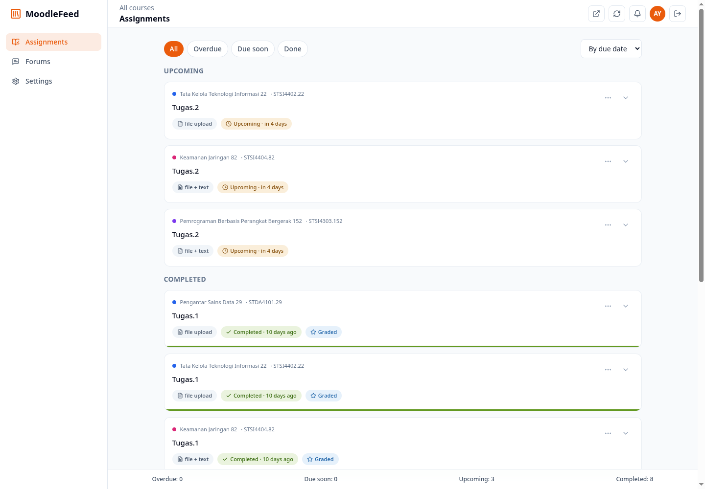
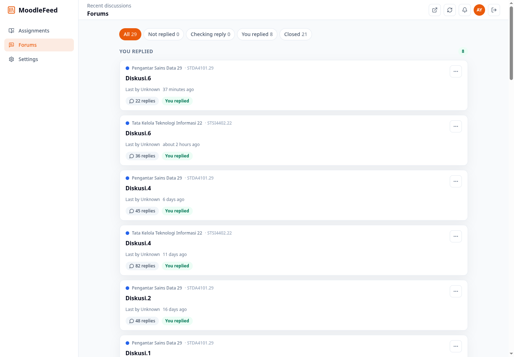

# MoodleFeed

MoodleFeed is a modern web client for Moodle LMS. It gives students one place to track assignments, review submission status, read grades and feedback, and participate in forum discussions without jumping through Moodle's back water interface.

Try it here: https://moodlefeed.vercel.app/ (Proxy is disabled)

## Screenshots

### Assignments



### Forums



## Features

- Unified assignment feed across enrolled courses
- Assignment grouping by overdue, due soon, upcoming, and completed
- Moodle submission status, grades, feedback, submitted files, and online text
- Assignment brief rendering with Moodle attachments and inline image previews
- File upload and online text submission support
- Advanced Moodle mobile-link login support
- Forum thread feed with reply status checks and dismissed discussion filters
- Full discussion view with rendered Moodle HTML replies
- Sticky TipTap forum composer with rich text controls
- Claude prompt generation for forum replies
- Settings for notifications, appearance, sync interval, forum filters, and prompt template
- In-app notification inbox
- Dynamic light/dark theme and accent color support
- Production Moodle proxy for instances with restrictive CORS

## Tech Stack

- Vite + React + TypeScript
- Bun
- Tailwind CSS
- Zustand
- TanStack Query
- TipTap
- Radix Dropdown Menu
- Vercel serverless functions for production Moodle proxying

## Moodle Support

The app uses Moodle's standard web service endpoints:

- `login/token.php`
- `webservice/rest/server.php`
- `webservice/upload.php`

Students sign in with their Moodle URL, username, and password. MoodleFeed stores the returned token locally in the browser through the persisted auth store.

Advanced login also supports Moodle's mobile launch flow. Where supported, MoodleFeed can register a `web+moodlefeed` protocol handler and receive Moodle's mobile app token redirect. A paste fallback is available for `moodlemobile://token=...` links.

## Request Batching

MoodleFeed can batch high-volume read checks through `/api/moodle/batch` when the Vercel proxy is enabled. This reduces Vercel function invocations for expensive screens like forums and assignments.

Current batched groups include:

- course completion checks
- assignment submission statuses
- forum discussion listings
- forum post/reply checks

## Environment

Create a local env file when using the Vite development proxy:

```bash
cp .env.example .env
```

```env
VITE_MOODLE_BASE_URL=https://moodle.example.edu
```

`VITE_MOODLE_BASE_URL` is optional. It is useful in local development when a Moodle instance needs requests to go through Vite's `/moodle` proxy.

Production calls the Moodle URL directly by default. Enable the same-origin `/api/moodle` proxy only for Moodle instances with restrictive CORS:

```env
VITE_MOODLE_PROXY=vercel
```

## Development

Install dependencies:

```bash
bun install
```

Start the dev server:

```bash
bun run dev
```

Run checks:

```bash
bun run lint
bun run build
```

## Deployment

The app is designed for Vercel.

Recommended settings:

- Framework preset: Vite
- Install command: `bun install`
- Build command: `bun run build`
- Output directory: `dist`

No server-side Moodle base URL is required for production. By default, the browser calls the user-entered Moodle URL directly. If `VITE_MOODLE_PROXY=vercel` is set, requests are forwarded through the serverless proxy after validation.

## Security Notes

When enabled, the proxy only allows the Moodle endpoints required by the app and rejects non-HTTPS, localhost, and private-network Moodle targets. Moodle tokens still belong to the student and are sent only to the Moodle instance the student entered.

## Repository

GitHub: https://github.com/AndreasYNY/moodleFeed
